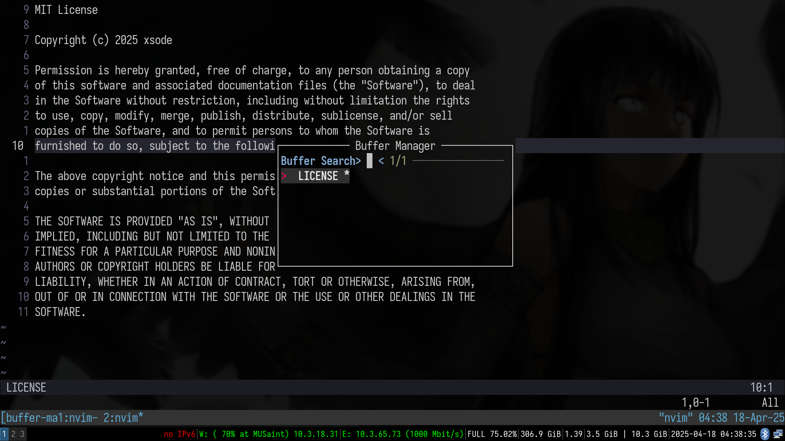

# buffer-manager

A Neovim plugin that provides buffer management with a clean, interactive UI.



## Features

- Interactive buffer list in a floating window
- Doom Emacs-like keybindings (`<leader>bb`)
- Support for buffer operations (select, delete, split)
- Customizable display options
- Integration with nvim-web-devicons for file icons
- Fuzzy finding with FZF integration
- Full-text search with ripgrep integration

## Installation

### Using [packer.nvim](https://github.com/wbthomason/packer.nvim)

```lua
use {
  'xsoder/buffer-manager',
  config = function()
    require('buffer-manager').setup()
  end
}
```

### Using [lazy.nvim](https://github.com/folke/lazy.nvim)

```lua
return {
  'xsoder/buffer-manager',
  config = function()
    require('buffer-manager').setup()
  end
}
```

### Using [vim-plug](https://github.com/junegunn/vim-plug)

```vim
Plug 'xsoder/buffer-manager'
```

Then in your Lua config:

```lua
require('buffer-manager').setup()
```

## Configuration

The plugin comes with sensible defaults but is fully customizable. Here's an example with all default options:

```lua
require('buffer-manager').setup({
  icons = true,
  use_devicons = true,
  default_mappings = true,
  mappings = {
    open = "<leader>bb",
    vertical = "<leader>bv",
    horizontal = "<leader>bs"
  },
  window = {
    width_ratio = 0.3,
    height_ratio = 0.3,
    border = "rounded",
    position = "center",
  },
  display = {
    show_numbers = true,
    show_modified = true,
    show_flags = true,
    path_display = "shortened",
  },
  fzf = {
    enabled = true,
    keybinding = "gf",
    prompt = "Buffer Search> ",
    preview = true,
    preview_window = "right:40%",
  },
  ripgrep = {
    enabled = true,
    keybinding = "gr",
    prompt = "Ripgrep search: ",
    args = {
      "--vimgrep",
      "--smart-case",
    },
  },
})
```

## Usage

### Default Keybindings

#### Outside Buffer Manager:

- `<leader>bb`: Open buffer manager
- `<leader>bv`: Open buffer manager in vertical split mode
- `<leader>bs`: Open buffer manager in horizontal split mode

#### Inside Buffer Manager:

- `j` / `k` or `<Down>` / `<Up>`: Navigate through buffers
- `<CR>` or double-click: Select buffer
- `d` or `D`: Delete buffer
- `v`: Open in vertical split
- `s`: Open in horizontal split
- `q` or `<Esc>`: Close buffer manager
- `/`: enter search mode
- Type to filter the buffer list in real-time
- Press `<Enter>` to apply the search filter or `<Esc>` to cancel
- `gf`: Open FZF fuzzy finder for buffers (customizable)
- `gr`: Search buffer contents with ripgrep (customizable)

### Commands

- `:BufferManager`: Open the buffer manager

## API

The plugin exposes several functions that can be used programmatically:

```lua
require('buffer-manager').open()
require('buffer-manager').open_vertical()
require('buffer-manager').open_horizontal()
require('buffer-manager').close()
require('buffer-manager').select_buffer()
require('buffer-manager').delete_buffer()
```

## Dependencies

- [nvim-web-devicons](https://github.com/nvim-tree/nvim-web-devicons) (optional): For file icons
- [fzf-lua](https://github.com/ibhagwan/fzf-lua) (optional): For fuzzy finding functionality
- [ripgrep](https://github.com/BurntSushi/ripgrep) (optional): For full-text search functionality
- [plenary.nvim](https://github.com/nvim-lua/plenary.nvim): Required for ripgrep integration

## License

MIT
